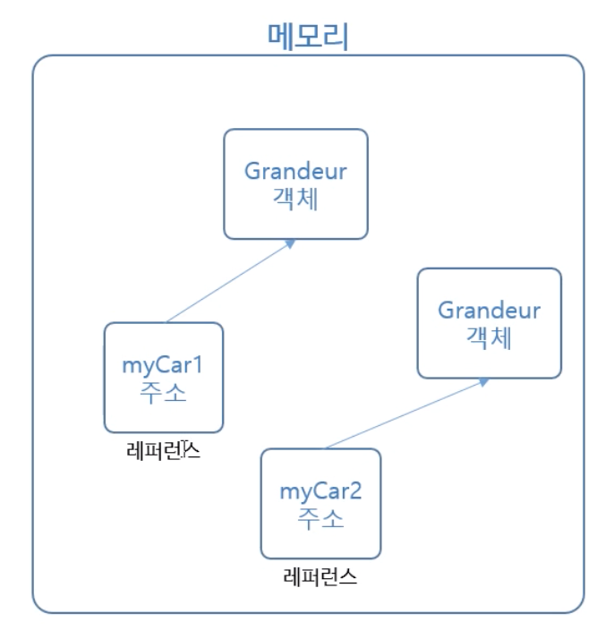

12장 클래스 제작과 객체 생성
======================
## 클래스 제장
* 클래스는 멤버 변수(속성), 메서드(기능), 생성자 등으로 구성된다.


## 객체 생성
* 클래스로부터 'new'를 이용해서 객체를 생성한다.
* 객체를 생성할 때, 해당 객체의 생성자가 가장 먼저 호출된다.

```
Grandeur myCar1 = new Grandeur();
Grandeur myCar2 = new Grandeur();
```

