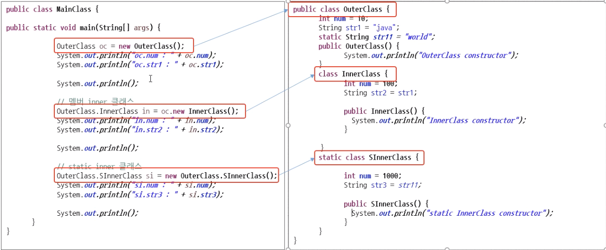

Java 문법 공부하기
===============
## Java 언어의 특징
### 초창기 시절의 Java 언어의 단점
* 기존 C/C++에 비해서 속도가 굉장히 느리다.
    - C/C++은 개발자가 메모리를 직접 접근하여 제어할 수 있지만, Java 그렇지 못하고, 중간에 다른 매개체를 갖고 있음
* 리소스(메모리, CPU)를 많이 사용한다.

### 현재 Java언어의 장점 
* 객체 지향 언어로 기능을 부품화할 수 있다.
* JRE를 이용해서 운영체제로부터 자유롭다.
    - 즉, OS 환경에 상관없이 개발할 수 있다.
* 웹 및 모바일 프로그래밍이 쉽다.
* CG를 통한 자동 메모리 관리를 지원한다.
    - 개발자 입장에서 메모리를 신경쓰지 않아도 된다.
* 실행 속도가 많이 개선되어 빨라졌다.

## Java 프로그래밍을 위한 기본 준비물
* JDK: 개발자가 Java를 이용해서 개발할 때 필요함
* JRE: Java로 만들어진 프로그래밍이 실행되기 위해 필요함 

## Java 프로그래밍의 실행 구조
* java 소스 작성부터 프로그램 실행까지의 순서(중)


* 가비지 컬렉터(Garbage Collector)
    - 프로그램 실행에 필요한 메모리를 가비지 컬렉터가 자동으로 관리한다.
    - C계열 프로그램
        + 개발자가 직접 메모리를 관리해야 한다.
        + 만약 메모리 관리를 잘못할 경우 메모리 누수가 발생하고 타 프로그램 동작이 멈출 수 있다.
    - Java 프로그램
        + 개발자가 메모리에 접근할 수 없다.
        + 따라서 개발자는 메모리 관리를 할 수 없고, 가비지 컬렉가 불필요한 메모리를 회수해서 메모리를 최적화 한다.
## 변수
### 변수란?
* 데이터(자료)를 임시로 담을 수 있는 메모리 공간

## 자료형 
* 기본 자료형은 데이터가 변수에 직접 저장되고, 객체 자료형은 객체 메모리 주소가 변수에 저장된다.


* 객체 메모리 주소가 담겨져 있는 변수에 저장되는 데이터의 크기 4byte로 고정되어 있다.
* 기본 자료형은 정수, 실수, Boolean 등 그 종류에 따라 변수에 저장되는 데이터의 크기가 달라진다.

### Java 기본 자료형
* 기본 자료형은 모두 소문자로 표시 
* 정수형
    - byte
    - **char**
        + ex) a, b, c ...
        + 문자들을 아스키코드(특정 숫자)로 대체
    - short
    - **int**
    - long
* 실수형
    - float
    - **double**
* 논리
    - **boolean**
    

    
    
### Java 객체 자료형
* 객체 자료형은 제일 앞 글지를 대문자료 표시
* 문자형
    - String
        + ex) String str = "ABCD";

### 형 변환
* 자동적 형 변환: 작은 공간의 메모리에서 큰 공간의 메모리로 이동
    - 큰 문제 없이 변환됨 
```
byte by = 10;
int in = by;
System.out.printIn("in = " + i);

in = 10
```
* 명시적 형 변환: 큰 공간의 메모리에서 작은 공간의 메모리로 이동
    - 명시적 형 변환은 데이터가 누실될 수 있다. 
```
int iVar = 100; 
byte bVar = (byte)iVar;
System.out.println("bVar = " + bVar);

bVar = 100
----------------------------------
iVar = 123456;
bVar = (byte)iVar;
System.out.printLn("bVar = " + bVar)

bVar = 64
```

## 특수 문자와 서식 문자
* 일반적으로 사용하는 문자가 아닌 특수한 경우 또는 특정 서식에 맞게 사용하는 문

### 특수 문자
* 일반 문자가 아닌 특수한 목적으로 사용되는 문자
* 종류
    - \t: 탭
    - \n: 줄바꿈
    - \': 작은 따옴표
    - \": 큰 따옴표 
    - \\: 역슬래시 
* 주석
    - 컴파일러가 컴파일하지 않고 무시하는 부분
    - 한 줄 주석: // 주석입니다.
    - 여러줄 주석: /* 주석입니다. */ 
    
### 서식 문자
* 일반 문자가 아닌 서식에 사용되는 문자
* prinf() 메소드를 이용한다.
    - f는 format(형식)을 뜻한다.
* 종류
    - %d: 10진수
    - %o: 8진수
    - %x: 16진수
    - %c: 문자
    - %s: 문자열
    - %f: 실수 


* println() 은 해당 문자열을 출력하고 자동으로 줄바꿈이 되지만, printf()는 자동으로 줄바꿈이 안되기 때문에 \n으로 줄바꿈을 해줘야 한다.

## 연산자
* 프로그램이 실행될 떄 컴퓨터(CPU)한테 계산(연산)업무를 시키기 위한 방법

### 단항 연산자
* 피연산자가 하나 존재 
* ex) +x, -x, !x

### 이항 연산자
* 피연산자가 두개 존재
* ex) x=y, x<y

### 삼항 연산자
* 피연산자가 세개 존재 
* 조건식: true ? false

### 대입 연산자
* '='는 수학에서 '오른쪽 값과 왼쪽 값이 같다'라는 의미이지만, 프로그램에서는 '오른쪽 값을 왼쪽에 대'하는 의미로 쓰인다.
* 프로그램에서 '오른쪽과 왼쪽이 같다'라는 의미는 '=='이다. 

### 산술 연산자
* +, -, /, % 등

### 복합 대입 연산자
* 산술 연산자와 대입 연산자를 결합한 연산자
* +=, -=, *=, /=, %= 등

### 관계 연산자
* 두 개의 피연산자를 비교해서 참/거짓의 결론을 도출한다.
* >, >=, <, <=, ==, != 등

### 증감 연산자
* 1만큼 증가하거나 감소를 수행한다.
* ++: 1만큼 증가
* --: 1만큼 감소 


### 논리 연산자
* &&: 논리 곱(AND)
* ||: 논리 합(OR)
* !: 논리 부정(NOT)

### 조건(삼항) 연산자
* 삼항 연산자로 두개의 피연산자 연산 결과에 따라서 나머지 피연산자가 결정된다.
* 조건식 ? 식1:식2
    - 조건식이 참이면 식1이 실행되고, 조건식이 거짓이면 식2가 실행된다.


### 비트 연산자
* java 에서는 자주 사용되지 않
* 데이터를 비트(bit)단위로 환산하여 연산을 수행하며, 다른 연산자보다 연산 속도가 빠르다. 
* &: AND 연산
    - a & b: a와 b가 모두 1이면 1
* |: OR 연산
    - a | b: a와 b중 하나라도 1이면 1
* ^: XOR 연산
    - a^b: a와 b가 같지 않으면 1
   

## 배열
* 다수의 데이터를 인덱스를 이용해서 관리하는 방법 

### 배열이란?
* 인덱스를 이용해서 **자료형이 같은 데이터**를 관리하는 것이다.
* 배열 선언 및 초기화: 배열도 변수와 마찬가지로 선언과 초기화 과정을 거쳐 사용한다.
    - 배열 선언 후 초기화
    - 배열 선언과 초기화를 동시에 
* 배열은 주로 많은 데이터를 쉽게(효율적) 관리하기 위해서 사용한다.

## 배열과 메모리
* 배열을 구성하는 데이터의 자료형에 따라서 배열의 메모리 크기가 결정된다.
* 기본 자료형 데이터를 담고 있는 변수와 달리 배열 변수는 배열 데이터의 주소를 담고 있다. 
   

* int[] i 에서 i에는 배열의 첫번째 인덱스의 시작주소가 저장되어 있다. 

### 배열의 기본 속성
* 배열 길이
```
int[] arrAtt1 = {10, 20, 30, 40, 50, 60}
System.out.println(arrAtt1.length)
```

* 배열 요소 출력
```
System.out.println(Arrays.toString(arrAtt1));
```
* 배열 요소 복사
```
arratt2 = Arrays.copyOf(arrAtt1.length); 
```
* 배열 레퍼런스
```
arrAtt3 = arrAtt1;
System.out.println(arrAtt1);
System.out.println(arrAtt2);
System.out.println(arrAtt3);
----------------------------
I@455617c
I@74a14482
I@455617c
```

### 다차원 배열
* 배열 안에 또 다른 배열이 존재한다.
* 이차원 배열 ~ n차열 배열
    - 이차원 배열까지는 자주 사용되지만, 3차원 배열부터는 메모리 사용량 급증으로 인한 성능 저하때문에 자주 사용되지 않는다.
```
int[][] arrMul = new int[3][2];
arrMul[0][0] = 10;
arrMul[0][1] = 100;
```

## 조건문
* 프로그램이 조건의 결과에 따라 양자 택일 또는 다자 택일을 진행하는 조건문

### 조건문이란?
* 조건의 결과에 따라서 양자 택일 또는 다자 택일을 진행한다.
    - 양자 택일: 주로 if문이 사용된다.
    - 다자 택일: 주로 switch문이 사용된다.
* if 문
    - if문
    - if문 + else문
    - if문 + else if 문
    - if문 + else if 문 ... + else문 등 조합은 다양함 
* switch 문
    - 비교대상이 되는 결과값과 선택사항이 많을 경우 주로 사용한다.
```
System.out.println("점수를 입력하세요.: ");
Scanner inputNum = new Scanner(System.in);
int sore = inputNume.nextInt();

switch (score) {
case 100:
case 90:
System.out.println("수");
break;

default:
System.out.println("다시 시도");
break;
}

inputNum.close();
```

## 반복문
* 프로그램 진행을 특정 조건에 따라 반복적으로 진행하는 것
* for문
    - for(초기값, 조건식, 증가되는 코드)
```
for(inti=1; i<10; '반복문이 끝나고 실행할 코드')
```
* while문
    - while(조건식) -> 초기값, 증가되는 코드는 while 외부에 존재
```
i = 0
while(i<10) {
    ...
    i++;
}
```

* do ~ while문
    - while문과 비슷하며, 차이점은 조건 결과에 상관없이 무조건 최초 한번은 ~ 위치에 해당하는 프로그램을 수행한다.
```
do {
    System.out.println("무조건 한번은 실행됩니다!");
} while(false);
```

## 클래스 제작과 객체 생성
### 클래스 제장
* 클래스는 멤버 변수(속성), 메서드(기능), 생성자 등으로 구성된다.


### 객체 생성
* 클래스로부터 'new'를 이용해서 객체를 생성한다.
* 객체를 생성할 때, 해당 객체의 생성자가 가장 먼저 호출된다.

```
Grandeur myCar1 = new Grandeur();
Grandeur myCar2 = new Grandeur();
```


## 메서드
* 클래스가 객체를 생성했을 때, 객체의 기능
* 매서드도 변수와 같이 선언 및 정의 후 필요시에 호출해서 사용한다.
* 객체와 도트접근자를 이용해 해당 메소드를 사용한다. 
* 구성
    - 호출부
    - 선언부
    - 정의부 
* 메서드명
    - 소문자로 시작한다.
    - CamelCase를 사용한다.
    - 동사 + 명사/목적어 형식


### 중복 메서드(overloading) / 메서드 오버로
* 이름은 같고, 매개변수의 개수 또는 타입이 다른 메서드를 만들 수 있다. 

### 접근자
* 메서드를 호출할 때 접근자에 따라서 호출이 불가할 수 있다.
* 종류
    - public: 외부에 공개된 메서드 즉, 외부에서 호출할 수 있는 메서드 
    - priavate: 클래스 내부에서만 사용할 수 있는 메서드 
    - protect


## 객체와 메모리
### 메모리에서 객체 생성(동적 생성)
* 객체는 메모리에서 동적으로 생성되며, 객체가 더 이상 필요 없게 되면 GC(Gabage Collector)에 의해서 제거된다.
* 클래스가 같은 객체들이라해도 메모리에서 다른 공간에 있는 다른 객체들이다. 
* 자료형이 같아도 메모리 내에 다른 공간에 존재하는 객체는 다른 객체이다. 

### null과 NullPointException
* 레퍼런스에 null이 저장되면 객체의 연결이 끊기며, 더 이상 객체를 이용할 수 없다. 
* 연결이 끊긴 객체는 GC에 의해서 회수되며, 객체가 저장됬었던 공간은 비워지게 된다.

## 생성자와 소멸자 그리고 this
### 디폴트 생성자
* 객체가 생성될 때 가장 먼저 호출되는 생성자로, 만약 개발자가 명시하지 않더라도 컴파일 시점에 자동 생성된다.
* 만약 사용자 정의 생성자가 정의되어 있다면, 컴파일러 디폴트 생성자를 생성하지 않는다.


### 사용자 정의 생성자
* 디폴트 생성자 외에 특정 목적에 의해서 개발자가 만든 생성자로, 매개 변수에 차이가 있다.


### 소멸자
* 객체가 GC에 의해서 메모리에서 제거될 때 finalize() 메서드가 호출된다.
 


### this 키워드 
* 현재 객체를 가리킬 때  this를 사용한다.
* 변수를 사용할 수 있는 볌위에 따라 구분
    - 지역변수: 선언 위치가 '메소드나 생성자 내부'이다.
    - 전역 변수(멤버 변수): 선언위치가 '클래스 영역'이다. 
        + 클래스 변수: 모든 객체가 공통적으로 똑같은 속성을 가져야 할때 사용
        + 인스턴스 변수: 각각의 객체(=인스턴스)마다 개별적인 속성을 가져야 할 때 사용
        
## 패키지와 static
* 패키지: class 파일을 효율적으로 관리하기 위한 방법
* static: 객체 간에 속성 또는 긴으을 공유하는 방법  

### 패키지
* java 프로그램은 많은 클래스로 구성되고, 이러한 클래스를 폴더 형식으로 관리하는 것을 **패키지**라고 한다.
* 패키지 이름 결정 요령
    - 패키지 이름은 패키지에 속해 있는 클래스가 최대한 다른 클래스와 중복되는 것을 방지하도록 만든다.
    - (같은 이름의 클래스를 갖고 있더라도 다른 패키지에 존재)
        + employee
        + fullTime
        + welfare 등
    - 패키지 이름은 일반적으로 도메인을 거꾸로 이용한다.
        + ex) com.java.패키지 이름 / 도메인.패키지이름 
    - 개발 중에 패키지의 이름과 구조는 변경될 수 있다.
    - 패키지 이름만 보고도 해당 패키지 안에 있는 클래스가 어떤 속성과 기능을 가지고 있는지 예상될 수 있도록 이름을 만든다.
* 다른 패키지에 있는 클래스를 사용하기 위해서는 import 키워드를 이용한다.

### static
* 클래스의 속성과 메서드에 static 키워드를 사용하면, 같은 클래스에서 생성된 객체는 어디서나 속성과 메서드를 공유할 수 있다.

## 데이터 은닉 
* 객체가 가지고 있는 데이터를 외부로부터 변질되지 않게 보호하는 방법
### 멤버변수의 private 설정
* 멤버 변수(속성)는 주로 private으로 설정해서, 외부로부터 데이터가 변질되는 것을 막는다.
* 데이터(속성) 변질이 우려되는 시나리오(예시)
    - 직원 급여 프로그램에서, 급여 담당자가 실수로 급여액을 잘못 입력하는 경우
    - 변경될 수 없는 사번이 변경되는 경우
    
### getter, setter
* 멤버 변수를 외부에서 변경할 수 있도록 하는 메서드


## 상속
* 기존에 만들어진 클래스의 기능을 상속받아서 새로운 클래스를 쉽게 만들 수 있는 방법에 대해서 학습

### 상속이란?
* 부모 클래스를 상속받은 자식 클래스는 부모 클래스의 속성과 기능도 이용할 수 있다.
* 자식 클래스의 객체를 생성할 때, 부모 클래스의 객체가 먼저 생성된다.
    - 먼저 생성된(메모리에 로딩된) 부모 클래스의 객체를 상속받아 자식 클래스의 객체가 생성됨
* java 언어에서는 **단일 상속**만을 지원한다.
    - 한 클래스는 하나의 클래스만을 상속받을 수 있다. 

### 상속의 필요성
* 기존의 검증된 class를 이용해서 빠르고 쉽게 새로운 class를 만들 수 있다. 

### 부모 클래스의 private 접근자
* 자식 클래스는 부모 클래스의 모든 자원을 사용할 수 있지만, private 접근자의 속성과 메서드는 사용할 수 없다.

## 상속 특징
* 상속관계에 있는 클래스의 특징

## 메서드 오버라이드(override)
* 부모 클래스의 기능을 자식 클래스에서 재정의해서 사용한다.
* **@Override** 어노테이션 사용

```
public class ParentClass {
    public ParentClass() {
        System.out.println("ParentClass constructor");
    }
    
    public firstfunc() {
        System.out.println("Parent first func");
    }
}


public class FirstChildClass extends ParentClass {
     
     @Override
     public firstfunc() {
         System.out.println("FirstChild first func");
     }
 }
 
public class SecondChildClass extends ParentClass {
     
     @Override
     public firstfunc() {
         System.out.println("SecondChild first func");
     }
 }
```

### 자료형(타입)
* 클래스도 자료형이다.
```
ParentClass childs[] = new ParentClass[2];
childs[0] = new FirstChildClass();
childs[1] = new SecondChildClass();
```
* 배열에는 같은 자료형의 데이터가 입력되어야 하기에 ParentClass 자료형의 childs 배열을 만들어준다.

```
ParentClass childs[] = new ParentClass[2];
ParentClass fch = new FirstChildClass();
ParentClass sch = new SecondChildClass();

childs[0] = fch;
childs[1] = sch;
```
* FirstChildClass 객체와 SecondChildClass 객체를 생성할 때 ParentClass 자료형으로 통일이 가능하다.
    - 두 클래스 모두 ParentClass를 상속받고 있는 객체이기 때문이다.

### Object 클래스
* 모든 클래스의 최상위 클래스는 Object이다.
* 모든 클래스의 데이터타입을 Object로 통일시킬 수 있다.


### super 클래스
* 상위 클래스를 호출할 때 super키워드를 이용한다.


## 내부 클래스와 익명 클래스
* 클래스 안에 또다른 클래스를 선언하는 방법과 이름이 없는 클래스를 선언하는 방법

### 내부(inner) 클래스
* 클래스 안에 또다른 클래스를 선언하는 것으로 이러한 방식을 통해 두 클래스의 멤버에 쉽게 접근할 수 있다. 
* 단점
    - 객체 내에 또다른 객체가 존재하는 것은 객체 지향 프로그래밍 패러다임과 맞지 않다.
    - 로직이 복잡해질 수 있다.
* 실무에서 많이 사용되지 않는 코딩 방식이다.


   
### 익명(anonymous) 클래스
* 이름이 없는 클래스로 주로 매서드를 재정의(override)하는 목적으로 사용된다. 
* 익명 클래스는 인터페이스나 추상클래스에서 주로 이용된다. 
* 익명 클래스의 객체는 한번 사용되고, 버려진다. 
* 익명 클래스의 객체를 생성하고, 바로 도트 접근자를 이용해 해당 객체의 필요한 메소드를 사용한다. 


## 인터페이스
* 객체가 다양한 데이터 타입을 가질 수 있는 방법(인터페이스 기능의 일부)
 
### 인터페이스란? 
* 클래스와 달리 객체를 생성할 수 없으며, 클래스에서 구현해야 하는 작업 명세서이다.
* 인터페이스 내 함수는 선언부만 존재한다.
    - 정의부는 없다.
    - 이 함수는 인터페이스를 구현하는 클래스에서 해당 함수를 정의를 새롭게 하여 사용한다.


* 인터페이스 구현: class대신 interface 키워드를 사용하며, extend 대신 implements 키워드를 이용한다. 


* 인터페이스를 사용하는 이유
    - 인터페이스를 사용하는 이유는 많지만, 가장 큰 이유는 객체가 다양한 자료형(타입)을 가질 수 있기 때문이다.

```
public interface InterfaceA {
    public void funA();
}

public interfate InterfaceB {
    public void funB();
}
```    

* 인터페이스는 **다형성**을 지원한다.(객체가 사용할 수 있는 자료형이 확장된다.)
    - 클래스가 구현하는(implements) 인터페이스의 모든 메서드는 클래스에서 재정의(override)해주어야 한다.
 
```
public class Interfaceclass implements InterfaceA, InterfaceB {
    
    public Interfaceclass() {
        System.out.println("-- Interfaceclass constructor --")
    }
    
    @Override
    public void funA() {
        System.out.println("-- funA() --");
    }
    
    @Override
    public void funB() {
        System.out.println("-- funB() --");
    }
}


InterfaceA ia = new Interfaceclass();
InterfaceB ib = new Interfaceclass();

ia.funA();
ib.funB();

ia.funB(); // 오류 발생 
```


### 인터페이스 예제


```
// Toy 인터페이스
public interface Toy {

    public void walk();
    public void run();
    public void alarm();
    public void light();
}

//Toy 인터페이스를 구현한 ToyAirplne 클래스
public ToyAirplne implements Toy {

    @Override
    public void walk() {
    ...
    }
    
    @Override
    public void run() {
    ...
    }
    
    @Override
    public void alarm() {
    ...
    }
    
    @Override
    public void light() {
    ...
    }
}

// Main 클래스
public static void main(String[] args) {
    
    Toy robot = new ToyRobot();
    Toy airplce = new ToyAirplne();
    
    Toy toys[] = {robot, airplane}; 
    
    for (int i = 0; i < toys.length; i++) {
        toys[i].walk();
        toys[i].run();
        toys[i].alarm();
        toys[i].light();
    }
}
```


#
### 필기 출처
* [인프런 강좌](https://www.inflearn.com/course/%EC%8B%A4%EC%A0%84-%EC%9E%90%EB%B0%94_java-renew/dashboard)


